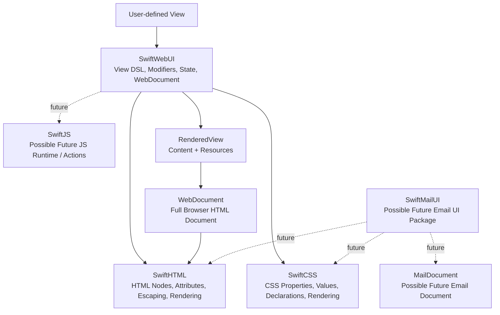

# Architecture

This project is evolving into a layered Swift web ecosystem. The central rule is:

> SwiftWebUI is not a replacement for SwiftHTML or SwiftCSS.

SwiftWebUI provides a SwiftUI-like declarative view layer for browser-based web UI. Low-level HTML and CSS remain owned by the packages designed for those concerns.

## Core Principle

SwiftHTML owns HTML.  
SwiftCSS owns CSS.  
SwiftWebUI owns web UI intent.

If a type exists in more than one of those layers, it is usually a design smell.

## Intended Layering



The dependency direction should remain clear:

- `SwiftWebUI` may depend on `SwiftHTML` and `SwiftCSS`.
- `SwiftWebUI` may contain `WebDocument` because this package is specifically the web UI package.
- `SwiftHTML` must not depend on `SwiftWebUI`, `SwiftCSS`, app concepts, or document concepts.
- `SwiftCSS` must not depend on `SwiftWebUI`, `SwiftHTML`, app concepts, or document concepts.
- Do not introduce `SwiftWeb` as a separate package unless explicitly requested later.
- Do not introduce `SwiftMailUI` or `MailDocument` now.

## Package Responsibilities

### SwiftHTML

`SwiftHTML` owns low-level HTML structure and rendering.

Responsibilities:

- HTML element types.
- Attributes.
- Text nodes.
- Escaping.
- Rendering HTML strings.
- Void and container element behavior.

Must not:

- Know about `SwiftWebUI` views.
- Know about `SwiftCSS` styling intent.
- Know about app, page, route, asset, export, or email concepts.

### SwiftCSS

`SwiftCSS` owns low-level CSS values, properties, declarations, and stylesheet rendering.

Responsibilities:

- `CSSProperty`.
- CSS values such as `Length`, `Color`, `Angle`, `Percentage`, and `Time`.
- Declarations.
- Stylesheet rendering.
- Properties such as `Border`, `Padding`, `Gap`, `Display`, `BackgroundColor`, and `BoxShadow`.

Must not:

- Depend on `SwiftWebUI`.
- Contain UI component concepts such as `ButtonStyle`.
- Contain page, website, routing, export, or email-client concepts.

### SwiftWebUI

`SwiftWebUI` owns the browser web UI layer.

Responsibilities:

- `View`.
- `ViewBuilder`.
- Primitive browser web views such as `Text`, `VStack`, `HStack`, `Grid`, `Button`, `Link`, `Image`, `Section`, `Article`, `Form`, `Label`, `Input`, `TextArea`, `Footer`, and `Div`.
- Modifiers stored as data and intent.
- `ButtonStyle` and semantic UI styling.
- `@State` and `Binding` architecture placeholders.
- Client-state and action intent.
- Style and resource collection through `RenderContext`.
- Converting `SwiftWebUI` views into `SwiftHTML` nodes and `SwiftCSS` resources.
- Rendering views into neutral `RenderedView` output with content and resources.
- `WebDocument`, a browser document target layer on top of `RenderedView`.

Must not:

- Reimplement HTML nodes.
- Reimplement HTML escaping.
- Create duplicate CSS property types.
- Create duplicate CSS value types such as `Color` or `Length`.
- Reintroduce `SwiftWebUI.Border` or `SwiftWebUI.Shadow` thin wrappers.
- Own email-specific rendering rules.
- Become a general site generator.

## Container Primitives

`Group` is the default layout-neutral composition primitive. It groups multiple views in the SwiftWebUI DSL without expressing HTML semantics or layout intent. An unmodified `Group` renders transparently and does not create a wrapper. When a `Group` has modifiers or attributes, the renderer creates an implicit `div` wrapper because HTML cannot attach attributes, classes, IDs, generated CSS classes, or client-state data attributes to nothing.

`Div` remains a public low-level HTML escape hatch. Use it when the desired output is specifically a `div`, or when a caller needs an explicit generic HTML container. It should stay small and should not become a custom HTML node system inside SwiftWebUI.

`VStack`, `HStack`, and `Grid` remain public layout primitives. They express vertical, horizontal, and grid layout intent and lower through SwiftCSS-backed layout declarations during rendering. They are not aliases for `Div`, even though the browser output currently uses `div` elements.

`Section` remains a public semantic container for HTML sectioning intent.

`Article` is a public semantic content container for self-contained HTML article intent, such as cards, posts, projects, and timeline entries. It lowers through `SwiftHTML.Article` and should stay structurally aligned with `Section` and `Div`.

`Link("Title", destination:)` is the shorthand for simple text anchors and renders direct anchor text. `Link(destination:) { ... }` is the container form for card and nested links; it preserves the same `href` behavior while allowing arbitrary child `View` content inside `SwiftHTML.A`.

`Form`, `Label`, `Input`, `TextArea`, and `Footer` are generic document and form primitives. They lower through matching SwiftHTML elements, preserve generic `.class`, `.id`, and `.attribute` modifiers, and intentionally avoid typed form-specific attributes until those APIs are designed. `Input` is a void element. `TextArea`, `Form`, `Label`, and `Footer` are container elements; `TextArea` currently renders an empty container.

`Text.semanticRole(_:)` expresses inline or block text meaning while keeping concrete HTML nodes in `SwiftHTML`. Plain `Text` defaults to `span`; callers can opt into paragraph or heading semantics with roles such as `.p` and `.h1`. Styling remains separate: `.font(...)`, `.foregroundStyle(...)`, `.class(...)`, and related modifiers control presentation and must not imply heading or paragraph HTML.

The current API audit found no container that is safe to remove without a breaking public API change. `GroupView` is currently public because the result builder uses it as an implementation carrier for multiple child expressions. Prefer `Group` for user-facing composition in new examples and code; `GroupView` should be treated as compatibility surface unless a future major release can make it internal.

### WebDocument

`WebDocument` belongs in `SwiftWebUI` for now.

It is responsible for wrapping rendered web content into a full browser HTML document:

- `<!DOCTYPE html>`.
- `<html>`.
- `<head>` with meta tags, optional title, and optional external stylesheet reference.
- `<body>` with rendered SwiftWebUI content and an optional external script reference.

`WebDocument` is a convenience/document target layer on top of `RenderedView`. It is not a replacement for the core renderer.

The core SwiftWebUI renderer still outputs:

```text
RenderedView
    -> content
    -> resources.styles
    -> resources.scripts
```

`WebDocument` may reference external CSS and JavaScript resources, but it should not inline CSS by default and should not decide broader bundling or routing behavior. It should not write files; small preview/export helpers may do that as developer tooling.

### Client-State Components

Components such as `TabBar` and `TabView` are generated-code-first. `TabBar(selection:)` supports a static selection value and renders only accessible tab controls, making it suitable for navigation tabs, segmented controls, filters, and timeline selectors. `TabView(selection:)` owns both the tab controls and the matching tab panels, making it suitable for tabbed content. Binding initializers such as `TabBar(selection: $binding)` and `TabView(selection: $binding)` use binding metadata to render client-state data attributes. The browser runtime is intentionally small: it listens for generated `set-state` actions and updates matching tab or panel attributes/classes. It does not run Swift in the browser, perform DOM diffing, evaluate arbitrary expressions, or translate general Swift closures to JavaScript. Tab styling must continue to lower through SwiftCSS declarations rather than direct CSS rendering in SwiftWebUI.

```swift
TabBar(selection: $section) {
    Tab("Home", value: Section.home)
    Tab("Work", value: Section.work)
}

TabView(selection: $section) {
    Tab("Home", value: Section.home) {
        Text("Home panel")
    }
    Tab("Work", value: Section.work) {
        Text("Work panel")
    }
}
```

### SwiftJS

`SwiftJS` is a possible future package for JavaScript generation and runtime primitives.

Likely responsibilities:

- JavaScript values, expressions, and statements.
- Runtime action primitives.
- State mutation lowering targets.
- Event-handler generation or serialization.

Must not:

- Own SwiftWebUI component concepts.
- Own website routing or static export.
- Replace `SwiftHTML` or `SwiftCSS`.

### SwiftMailUI

`SwiftMailUI` is a possible future independent package for email-safe rendering using related view ideas.

It is not implemented now. `MailDocument` is not implemented now.

Future `SwiftMailUI`:

- May contain `MailDocument`.
- Must not depend on `SwiftWebUI`.
- Will depend on lower-level neutral packages such as `SwiftHTML` and `SwiftCSS`.
- May duplicate some primitives initially if needed.

Likely responsibilities:

- Email-safe layout rules.
- Table-based layout where needed.
- Inline CSS rules required by email clients.
- Email-client compatibility constraints.

Must not:

- Force email-specific table or inline-style behavior into `SwiftWebUI`.
- Assume browser rendering rules.
- Own general website routing or browser preview behavior.

If duplication between `SwiftWebUI` and a future `SwiftMailUI` becomes painful later, extract a neutral shared core package then. Do not introduce that shared core now.

## Render Pipeline

The current browser web render pipeline is intentionally layered:

```text
SwiftWebUI View
    -> RenderContext
    -> SwiftHTML nodes
    -> SwiftCSS style resources
    -> RenderedView
        -> content.html
        -> resources.styles
        -> resources.scripts
    -> WebDocument when a full browser document is needed
```

`RenderedView` intentionally separates:

- HTML content.
- Style resources.
- Future script resources.

That separation matters because rendering a component is not the same thing as deciding final document output. `SwiftWebUI` can produce content and collect resources, while `WebDocument` can wrap that output for browser preview/testing without replacing the renderer.

## Modifiers Are Data

Modifiers should store intent instead of immediately rendering inline HTML or CSS.

For example:

```swift
Text("Hello")
    .semanticRole(.h1)
    .font(.largeTitle)
    .foregroundStyle(Color("var(--primary)"))
    .padding(.px(24))
```

This should be represented as `ViewModifierData` or equivalent modifier storage. It should not immediately commit to a particular HTML or CSS output shape.

Typography follows the same rule. `Text.semanticRole(_:)` controls HTML semantics, while generic visual typography modifiers such as `.letterSpacing(...)`, `.textTransform(...)`, `.lineHeight(...)`, `.textAlign(...)`, and `.textDecoration(...)` apply to any `View` and lower through SwiftCSS properties:

```swift
Text("Eyebrow")
    .font(.caption)
    .letterSpacing(.em(0.1))
    .textTransform(.uppercase)

Text("Paragraph")
    .lineHeight(.em(1.5))
    .textAlign(.center)

Link("Website", destination: "https://example.com")
    .textDecoration(.underline)
```

Keeping modifiers as data lets renderers choose among several output strategies:

- Inline styles.
- Generated CSS classes.
- Extracted stylesheets.
- Scoped component styles.
- Page-level resources.
- Future JavaScript bindings.

This is the main distinction between `SwiftWebUI` and a static HTML string builder. `SwiftWebUI` should model declarative view intent first, then lower that intent through a renderer.

## Resource Ownership

`SwiftWebUI` may collect resources and `WebDocument` may reference external resource paths.

Possible future bundling strategies include:

- One `app.css`.
- Multiple CSS files.
- Page-specific CSS.
- Component CSS.
- Critical CSS inline.
- A separate JavaScript runtime file.

`SwiftWebUI` should not hardcode final bundling decisions beyond the lightweight browser document defaults needed for preview/testing. It should expose enough structured output for later tooling to choose the appropriate strategy.

## Button Style Direction

`ButtonStyleToken` is a temporary and simple style token. It belongs in `SwiftWebUI` because button style is a UI and component concept, not a raw CSS concept.

A future custom `ButtonStyle` protocol may look more like SwiftUI. Even then, CSS declarations used by button styles should still be `SwiftCSS` types.

Example:

```swift
Link("Bekijk mijn werk", destination: "#work")
    .buttonStyle(.primary)

Button("Funico")
    .buttonStyle(.secondary)
```

The ownership rule is:

- `ButtonStyle` or `ButtonStyleToken`: `SwiftWebUI`.
- CSS declarations used by a button style: `SwiftCSS`.
- HTML element rendering for links or buttons: `SwiftHTML`.

## State And Binding Direction

`@State` and `Binding` are generated-code client-state declarations in `SwiftWebUI`. Full SwiftUI runtime behavior is not implemented.

`Binding` can carry optional `ClientStateBinding` metadata:

- a generated client-state key,
- the initial serialized value.

The current property wrapper implementation cannot capture Swift property names without adding macros or heavier wrapper machinery. Until that exists, `@State` uses a deterministic key derived from the backing storage object. That key is stable for the storage during a render pass, but it is not a public persistence identifier.

State values intended for generated client state should serialize through `ClientStateValue`, or through the explicit raw-value overloads provided by APIs such as `.set($binding, to:)`.

The lower-level `.setState(...)` API remains available as client-state intent. The preferred binding-driven primitive is:

```swift
Button("Show Contact")
    .set($selectedTab, to: PortfolioTab.contact)
```

That modifier lowers to generated attributes such as:

- `data-swiftwebui-action="set-state"`
- `data-swiftwebui-state-key="..."`
- `data-swiftwebui-state-value="contact"`

This syntax is intentionally not supported yet:

```swift
Button("Show Contact") {
    selectedTab = .contact
}
```

Closure-to-JavaScript translation is deferred. A future runtime or generation layer can lower button actions and state mutations into:

- Data attributes.
- Generated scripts.
- Event handlers.
- A separate runtime module.
- A `SwiftJS` representation.

The important architectural direction is:

> SwiftWebUI should be designed as a declarative view system, not merely a static HTML string builder.

## Anti-patterns

- Do not create custom HTML node systems inside `SwiftWebUI`.
- Do not duplicate `SwiftCSS` properties in `SwiftWebUI`.
- Do not duplicate `SwiftCSS` values in `SwiftWebUI`.
- Do not add thin string wrappers in `SwiftWebUI` unless they add real UI semantics.
- Do not reintroduce `SwiftWebUI.Border`, `SwiftWebUI.Shadow`, `SwiftWebUI.Color`, or `SwiftWebUI.Length`.
- Do not let `SwiftCSS` depend on `SwiftWebUI`.
- Do not create `SwiftWeb` as a separate package unless explicitly requested.
- Do not create `SwiftMailUI` or `MailDocument` now.
- Do not put email-specific table or inline-CSS rendering into `SwiftWebUI`.

Recent cleanup example:

`SwiftWebUI` previously had duplicate `Border`, `Shadow`, `Color`, and `Length` wrappers. These were removed because `SwiftCSS` already owns CSS properties and values. `SwiftWebUI` modifiers may store or lower to SwiftCSS types, but they should not define duplicate CSS property or value models. SwiftWebUI re-exports SwiftCSS for convenience, so clients can import SwiftWebUI and use SwiftCSS `Color`, `Length`, `Angle`, `Percentage`, and `Time` directly.

## Decision Table

| Concept | Owner | Reason |
| --- | --- | --- |
| HTML element rendering | `SwiftHTML` | Low-level HTML concern |
| CSS values such as `Color` and `Length` | `SwiftCSS` | CSS value syntax |
| CSS border property | `SwiftCSS` | CSS property |
| `.border(...)` modifier | `SwiftWebUI` | View API that stores CSS intent |
| `ButtonStyle` | `SwiftWebUI` | UI/component concept |
| `RenderedView` | `SwiftWebUI` | Neutral output from web UI rendering |
| `WebDocument` | `SwiftWebUI` | Browser document wrapper around rendered web UI |
| `MailDocument` | Future `SwiftMailUI` | Email document wrapper, not implemented now |
| Email-safe layout | Future `SwiftMailUI` | Email rendering concern |
| JS action runtime | `SwiftJS` or `SwiftWebUI` bridge | Future client interactivity |

## Current Status

- `SwiftWebUI` currently renders to `SwiftHTML`.
- CSS is collected as resources via `SwiftCSS`.
- JavaScript resources include a minimal generated client-state runtime for binding-driven `set-state` actions.
- `WebDocument` wraps `RenderedView` into a full browser HTML document for preview/testing.
- `@State` and `Binding` carry generated client-state metadata; they do not run Swift in the browser.
- The current package is `SwiftWebUI`.
- `SwiftWeb`, `SwiftMailUI`, and `MailDocument` do not exist.

## Next Decisions

- Should `ButtonStyleToken` evolve into a protocol-based `ButtonStyle`?
- Should JavaScript generation live in `SwiftJS` or inside `SwiftWebUI` first?
- How should generated CSS classes be scoped?
- When does browser document/export tooling become large enough to justify a separate package?
- How can a future `SwiftMailUI` reuse concepts without depending on browser-only SwiftWebUI behavior?

## Maintenance Rule

When introducing a new type, ask which layer owns the concept:

1. Is it HTML syntax, attributes, escaping, or element behavior?  
   -> SwiftHTML

2. Is it CSS syntax, values, properties, declarations, or stylesheet rendering?  
   -> SwiftCSS

3. Is it declarative browser UI structure, modifier intent, component styling, state, binding, or browser document wrapping?  
   -> SwiftWebUI

4. Is it JavaScript runtime or generated action behavior?  
   -> SwiftJS or a temporary SwiftWebUI bridge

5. Is it email-client-specific rendering behavior?  
   -> Future SwiftMailUI

If a type would only wrap a string and immediately convert to a same-meaning `SwiftHTML` or `SwiftCSS` type, it probably belongs in the lower-level package or should not exist.
